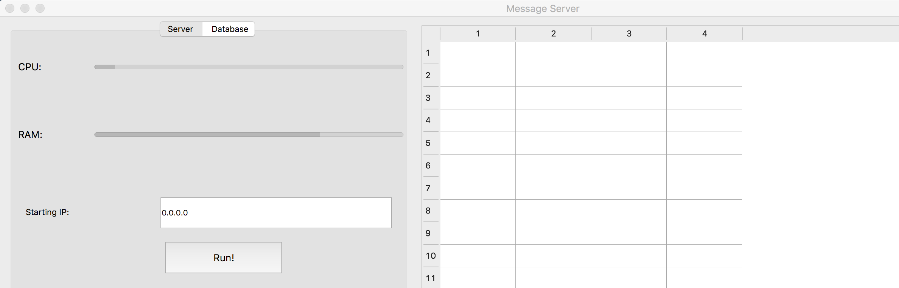
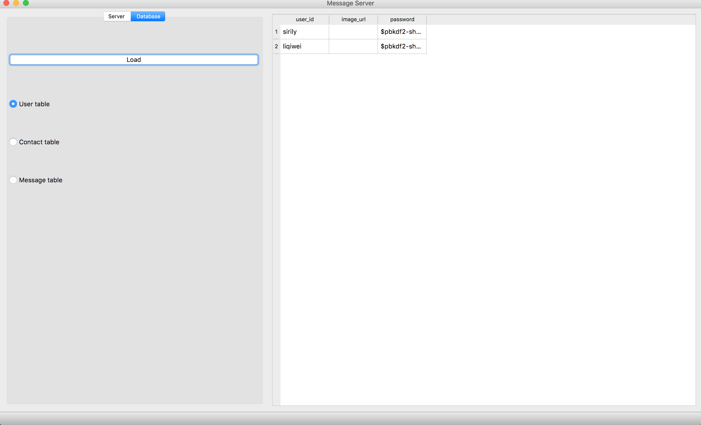
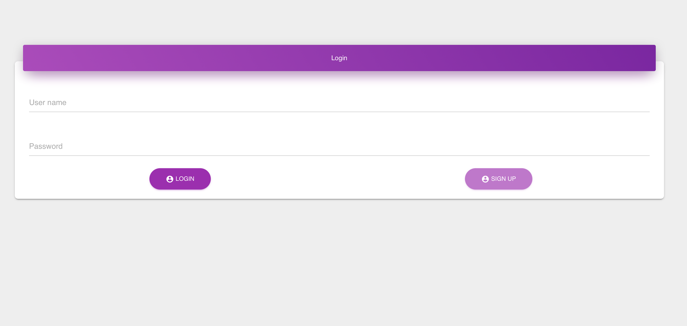
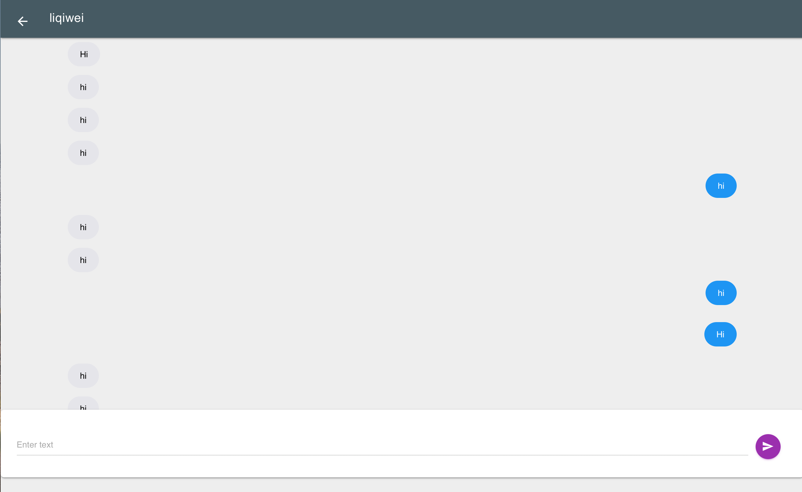

# Open Messager
Live demo: the whole app is deployed at AWS with docker, you can preview the app [here](message.sirileepage.com)
* Server side
* Client

## Server side

### Introduction
So the purpose of this project is aimed to provide a simple one-click set up message server for every one, so the project uses a GUI to let the user starts the server easily.
> The GUI still under developing. So the images will change in the future.

User can start the server with clicking the run button.



User can view the database with GUI



### Frameworks in use
* Quart - Asnyc webframework
* passslib - Password encoding
* PyQt5 - GUI building
* Messager - Main logic for messager
* SQLite - Database
* Docker - For deployment
* Pipenv - For development
> Warning: Docker only in use if you want to deploy the messager server on server. The reason why I use Docker is you can easily let the environment be the same as your developing computer. Don't need to worry about the dependecies.


### Python version
* Python 3.5 or higher
> Because We have async web framework in use. So only the python version over than 3.5 could use this application. However, we are using Python 3.7 for developing.

### Installation

* Using Pipenv
* Using Docker

First download the source files 
```
git clone https://github.com/sirily11/Open-Messager.git
```

then use the following method to run the rest of the installations.

### Using pipenv
First you should run
```
pip install pipenv
```
Or you can specify the pip version with if you on Mac or Linux
```
pip3 install pipenv
```
Or
```
pip3.7 install pipenv
```
Second install all dependencies
```
pipenv install
```
And finally run the GUI
```
pipenv run python gui.py
```

You can check the app to go to 0.0.0.0:5000 or localhost:5000 if you on windows.

> If you want to deploy the messager to a server, you can use docker to do so.

### Using Docker
First install the Docker, after installed the Docker, you can build the image from Dockerfile.
```
sudo docker build -t messageapp .
```
And then run the container
```
sudo docker run -it --rm -p 80:5000 --name messageapp message
```

## Test cases

We have provided a automated test with Pytest framework. You can install it, and then run the pytest test_contact_pytest.py in Messager folder.

## Client side

### Webapp
This is a webapp which use Javascript and HTML to build the whole app.

> The GUI design may be changed in the future.

* push.js - Notification 
* websocket - Data transfer

The screenshots for client side is here:

Login


Chatting




### Desktop 
The desktop version is planning now. More infomation in the future

### Mobile
The mobile version is on the way.
